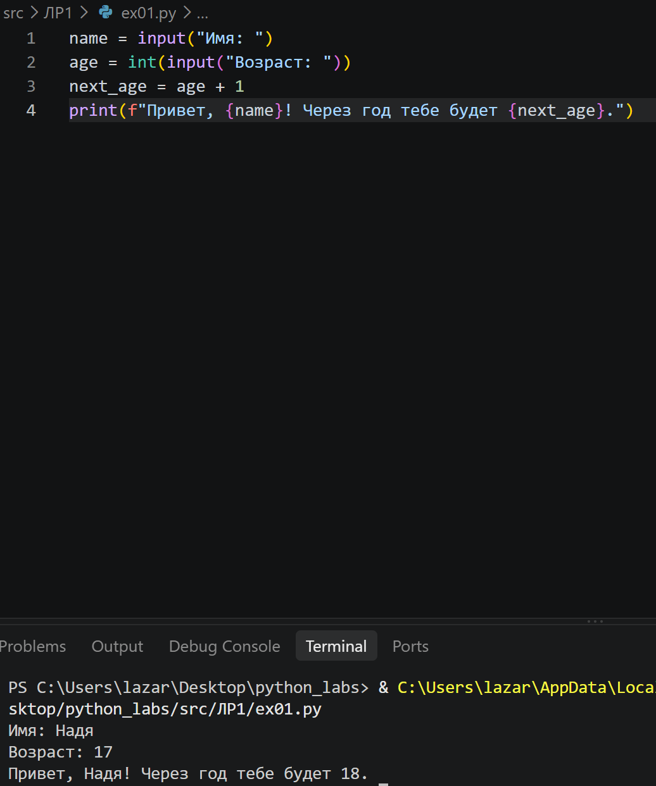
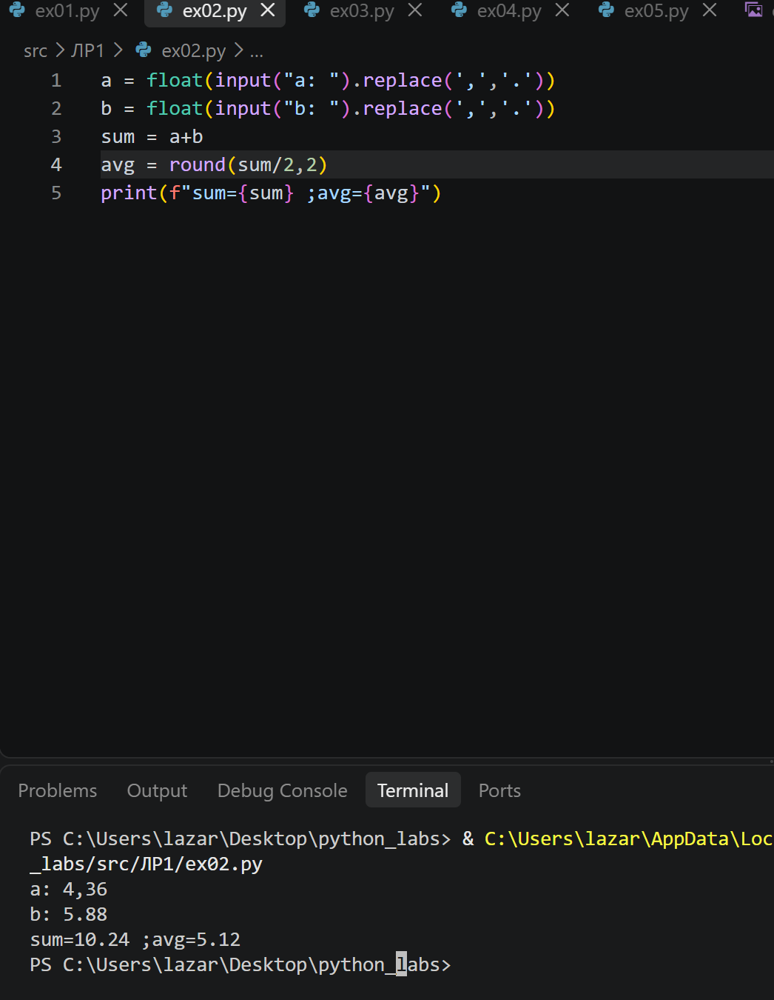
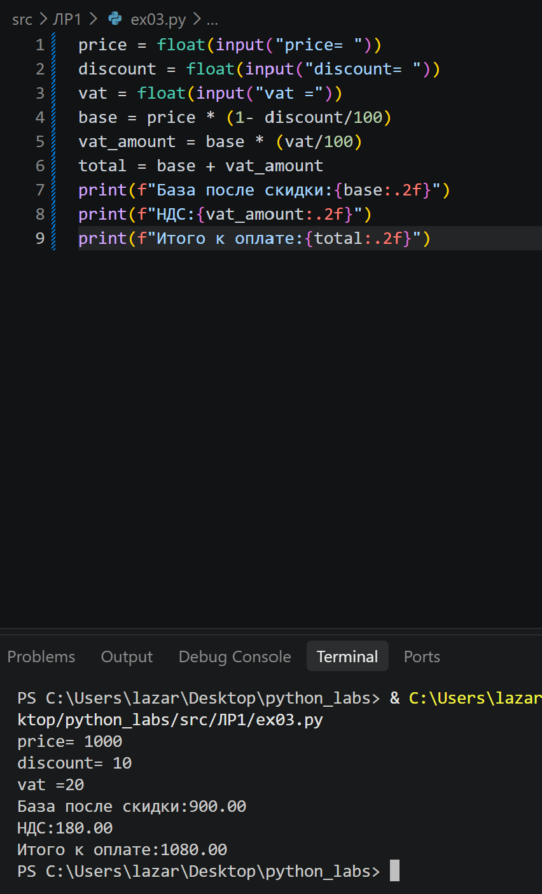
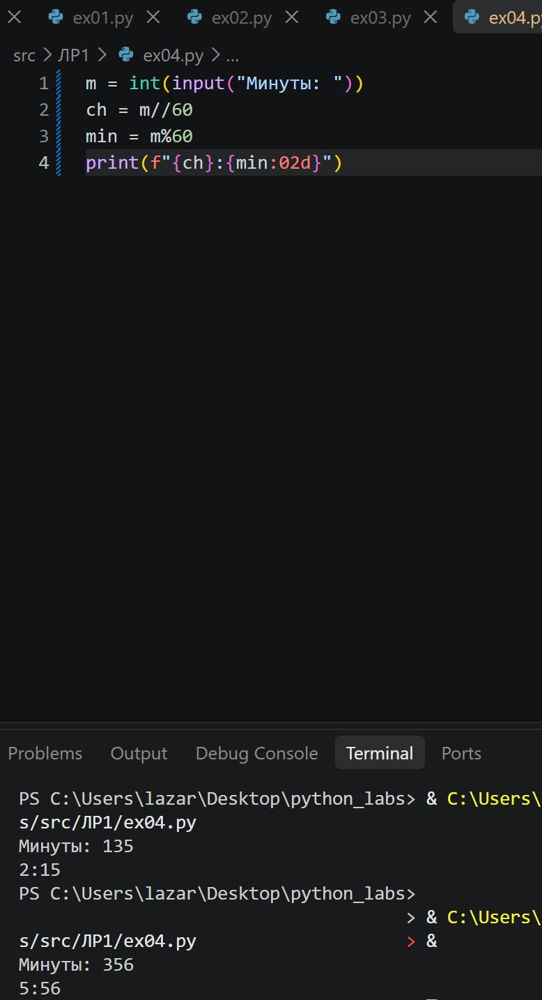
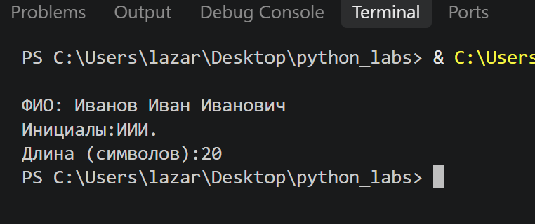
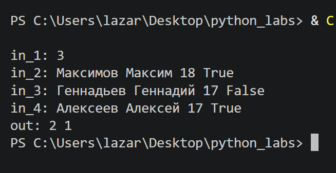
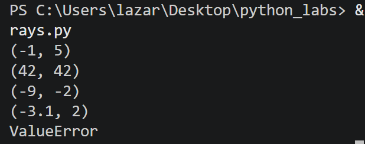
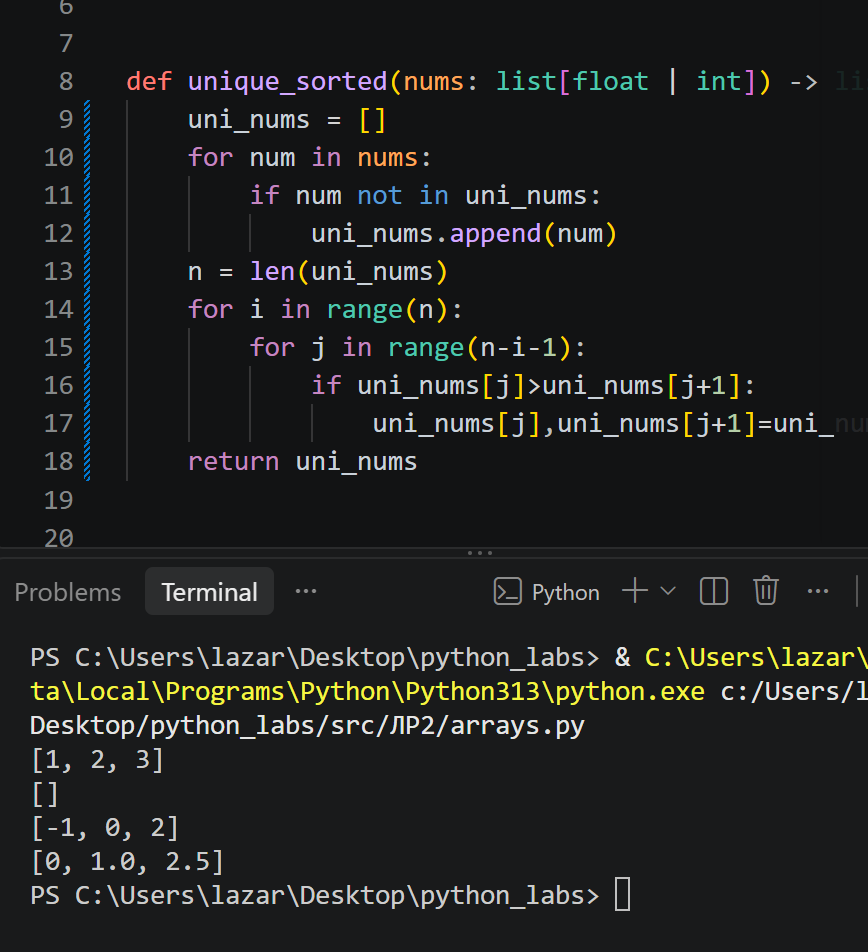
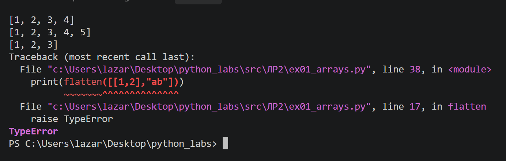

# python_labs
# Лабораторная работа 1
## Задание 1

### Считываем имя как строку, считываем возраст и преобразуем его в целое число. Вычисляем возраст, прибавляя год. Выводим результат через f-строку. 

## Задание 2

### Считываем первое и второе число, сразу заменяя запятые на точки, перед тем как перевести число в вещественное.Вычисляем сумму и среднее арифметическое.Среднее арифметическое округляем сразу, второй знак в скобке означает округление до двух знаков после запятой. Выводим результат через f-строку

## Задание 3

### Считываем входные данные в вещественном формате. Пишем соответствующие формулы для нахождения вывода. В принте делаем срез до двух знаков после запятой

## Задание 4

### Считываем минуты как входные данные. Находим часы через целочисленное деление минут на 60. Находим минуты через остаток от деления минут на 60.Выводим ответ, округляя до двух знаков

## Задание 5

### Считываем входные данные, учитывая пробелы.Проходимся по каждому введенному символу и записываем в переменную первые буквы и делаем их заглавными.Чтобы посчитать длину, склеиваем пробелы.Выводим результат через f-строки

## Задание 6

### Считываем количество строк. Создаем счетчик очного и заочного обучения. Проходимся по каждой строке с помощью цикла. Данные об учениках помещаем в переменную, разделяем по пробелам. Помещаем в переменную значение True/False. Далее условие, если это True, увеличиваем счетчик och на 1, аналогично со значением False. С помощью f-строки выводим результат.

# Лабораторная работа 2
## Задание 1.1

### Сначала проверяем список на пустоту. Если список пуст, выходит исключение ValueError. В противном случае сортируем список по возрастанию и возвращаем первое значение(т.е минимальное) и последнее значение(максимальное)

## Задание 1.2

### Пишем функцию. Создаем список, в который будем закидывать уникальные числа. Проходимся циклом по данным нам значениям, если какого-либо значения нет в списке, добваляем его туда. Добавляем длину полученных уникальных значений в переменную. Метод пузырька: создаем двойной цикл, обозначающий порядковый номер и длину. если первое значение числа больше последующего, меняем их местами. Так, у нас получится отсортированный уникальный список.

## Задание 1.3

### Пишем функцию, создаем пустой массив. Далее перебираем каждое значение списка. Если перед нами значение список(list) или кортеж(tuple), добавляем в пустой список по одному элементу(extend). В противном случае выводится ошибка. Если ошибки нет, возвращается заполненный список

## Задание 2.1

### Пишем функцию транспонирования матрицы. Если матрица пустая, возвращаем пустую матрицу. В переменную записываем длину первой строки матрицы. С помощью цикла перебираем все строки матрицы. Если длина какой-либо строки не совпадает с длиной первой строки, выводим ошибку(значит матрица рваная). В выводе звездочка(*) распаковывает список, то есть берет первые элементы, вторые и так далеею По сути, группирует элементы по индексам(по столбцам). zip возвращает кортежи, а нам нужны списки. Поэтому мы превращаем список в кортеж.

## Задание 2.2
 ### Пишем функцию суммы по каждой строке. Если матрица пустая, возвращаем пустую матрицу. С помощью цикла перебираем все строки матрицы. Если длина какой-либо строки не совпадает с длиной первой строки, выводим ошибку(значит матрица рваная). Выводим сумму каждой строки с помощью генератора.
 

 ## Задание 2.3

 ### Пишем функцию суммы по каждому столбцу.Если матрица пустая, возвращаем пустую матрицу. С помощью цикла перебираем все строки матрицы. Если длина какой-либо строки не совпадает с длиной первой строки, выводим ошибку(значит матрица рваная). В переменной записываем операцию транспонирования матрицы.  звездочка(*) распаковывает список, то есть берет первые элементы, вторые и так далеею По сути, группирует элементы по индексам(по столбцам). zip возвращает кортежи, а нам нужны списки. Поэтому мы превращаем список в кортеж. Выводим сумму столбцов с помощью генератора(перебора столбцов по переменной транспонирования).
 
 
 ## Задание 3

 ### Объявляем функцию, аргумент rec должен быть кортежем, состоящим из двух строк и одного вещественного числа. Если аргумент не удовлетворяет условию, то выходит ошибка(isistance-синтаксис, который выводит True, если условие в скобках верно и False-если нет). Заносим данные в переменную. Далее аналогично проверяем, соответствует ли условию fio, group и gpa. В переменную заносим fio, написанное без лишних пробелов по краям и разбитое по пробелам. Если не введено fio, выдает ошибку. Занесем фамилию отдельно в переменную. Чтобы фамилия всегда писалась с заглавной буквы, разбиваем её: первую буквву делаем всегда заглавной с помощью upper, остальные буквы вырезаем и делаем всегда строчными с помощью lower. Для всех остальных букв с помощью генератора берется первая буква, переводится в верхний регистр и добавляется точка. С помощью f-строки соединяем фамилию и инициалы и убираем лишние пробелы. Из названия группы убираем пробелы по краям. Если не введена группа, выдает ошибку. Если группа меньше 0 или больше 5(условие), выдает ошибку. Далее форматируем GPA: оставляем 2 знака после точки. С помощью f-строки возвращаем все отформатированные данные.
 
